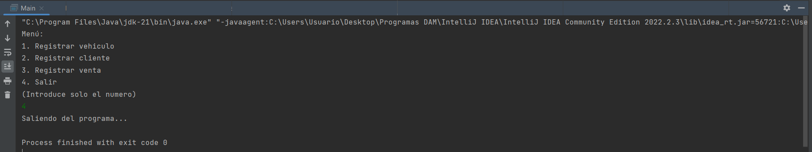

## Description de la tarea

La tarea consiste en modelar la empresa Automoviles SL para que pueda añadir los vehiculos que recibe, crear fichas de clientes y de ventas.

## ¿Cómo se ha implementado?

Se han creado las clases Vehicle, Customer y SalesData, con todo lo necesario para modelar objetos de ese tipo. Es decir, se han introducido los atributos y métodos necesarios. Además se ha probado en la clase Main para comprobar que no se producían errores.

## Keywords

Diagrama UML, clases, atributos, ArrayList, métodos, Main, branch.

## Screenshots or Video

